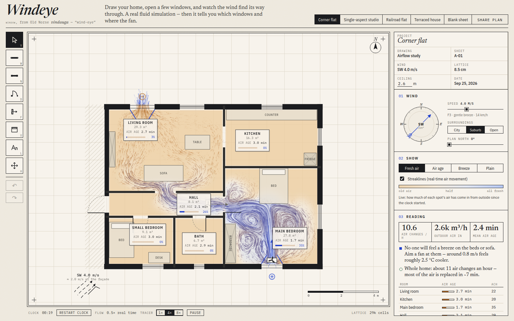
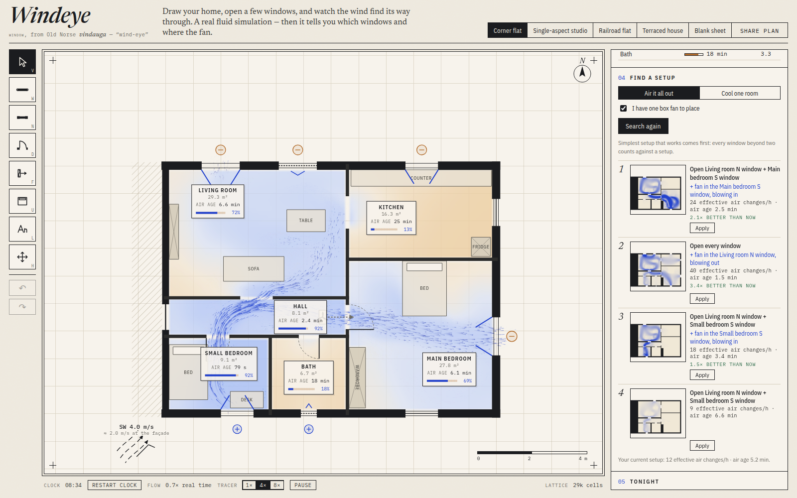
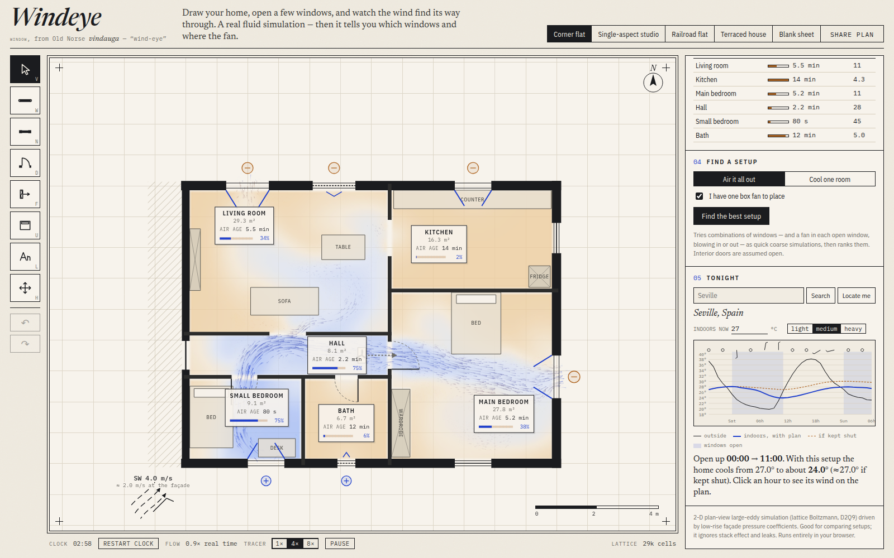

# Windeye

*window* — from Old Norse *vindauga*, "wind-eye".

**Draw your home, open a few windows, and watch the wind find its way through.** Windeye runs a real
fluid simulation of the air in your rooms, right in the browser, then tells you what to do: which
windows to open, where the one box fan should go, and — from tonight's actual forecast — when to
open up and how cool the place will be by morning.



## What you can do

- **Start from a plan** — corner flat, single-aspect studio, New York railroad flat, terraced house —
  or draw your own on a blank sheet (walls snap to corners, a 5 cm grid and right angles).
- **Click windows** to cycle *open → tilted → shut*, click doors to open/close them, drop fans and
  furniture (tall wardrobes block air, beds and sofas mostly don't).
- **Watch it**: streaklines show the air moving in real time; the wash shows fresh air pushing out
  the old ("fresh air" layer), how long air has been indoors ("air age"), or how much cooler the
  breeze feels ("breeze").
- **Read it**: whole-home air changes per hour, outdoor air flow, per-room air age, and plain-English
  advice ("Kitchen is a dead end — open its window", "tilted windows pass about a tenth of the air").
- **Find a setup**: Windeye runs dozens of quick simulations — window combinations, then a fan in
  each open window blowing in or out — and ranks them for *airing everything out* or *cooling one
  room*. One click applies the winner.
- **Tonight**: pick your town; Windeye pulls the Open-Meteo forecast, simulates your home in each
  of tonight's wind directions and plans the night: when to open, when to shut, and the indoor
  temperature you can expect versus keeping everything closed.
- **Share** a plan as a link; your work autosaves locally. Nothing leaves your browser except the
  forecast request.

| Find a setup | Tonight |
| --- | --- |
|  |  |

## How it works

| Piece | What it does |
| --- | --- |
| `src/sim/raster.ts` | Turns the vector plan into lattice masks: watertight walls, neighbour mass behind party walls, rooms by flood fill, openings carved at an effective width (opening height ÷ ceiling height; a tilted window passes ~12 %). |
| `src/sim/lbm.ts` | D2Q9 lattice Boltzmann with Smagorinsky large-eddy modelling, halfway bounce-back walls, gray-lattice partial blockage, exact-difference fan forcing, and a bounded upwind fresh-air tracer. ~15–20 M cell updates/s in plain JS inside a Web Worker. |
| Wind | A plan view can't let air flow *over* a building, so free-stream wind in 2-D wildly overstates façade pressures. Instead each exterior opening sits in an outdoor plenum held at its façade pressure — the approach multizone models such as NIST CONTAM use — with pressure coefficients from the Swami & Chandra low-rise correlation and slow gusting so single-sided rooms still breathe. |
| `src/sim/age.ts` | Steady *local mean age of air* (upwind, alternating Gauss–Seidel sweeps): per-room "air age" and effective air changes per hour. Air with no path outdoors (a shut-off room) reads as *stagnant*, not as a number that depends on how long the solver ran. |
| `src/sim/optimizer.ts` | Candidate setups + scoring; coarse headless runs in a worker pool. Each window beyond two costs a little, so a sharp two-window cross-draught can beat "open everything". |
| `src/weather/` | Open-Meteo geocoding/forecast and a lumped ISO 13790-style thermal model for the night plan. |

### Accuracy

A plain box with two opposite windows is checked against the empirical orifice model
`Q = Cd·A·U·√ΔCp` (Cd 0.61, ΔCp 0.9) in `src/sim/calibration.test.ts`; the simulation stays within
±40 % (it's typically 0.8–1.0×). Mass is conserved to about 1 % through doorways.

It is still a **2-D plan-view model**: no stack effect (warm air rising), no leakage paths, surface-
averaged façade pressures and simplified turbulence. Use it to compare setups and build intuition,
not for building-code compliance.

## Development

```bash
pnpm install
pnpm dev          # http://localhost:5173
pnpm test         # unit tests, including the physics calibration
pnpm typecheck && pnpm lint && pnpm build
pnpm exec tsx scripts/debug-render.ts corner 225 4   # headless run + field images
pnpm exec tsx scripts/calibrate.ts                   # compare against the empirical model
```

Keyboard: `V` select · `W` walls · `N` window · `D` door · `F` fan · `U` furniture · `L` name room ·
`H`/Space pan · `R` rotate · `Del` delete · `Ctrl+Z` / `Ctrl+Shift+Z` undo/redo.
